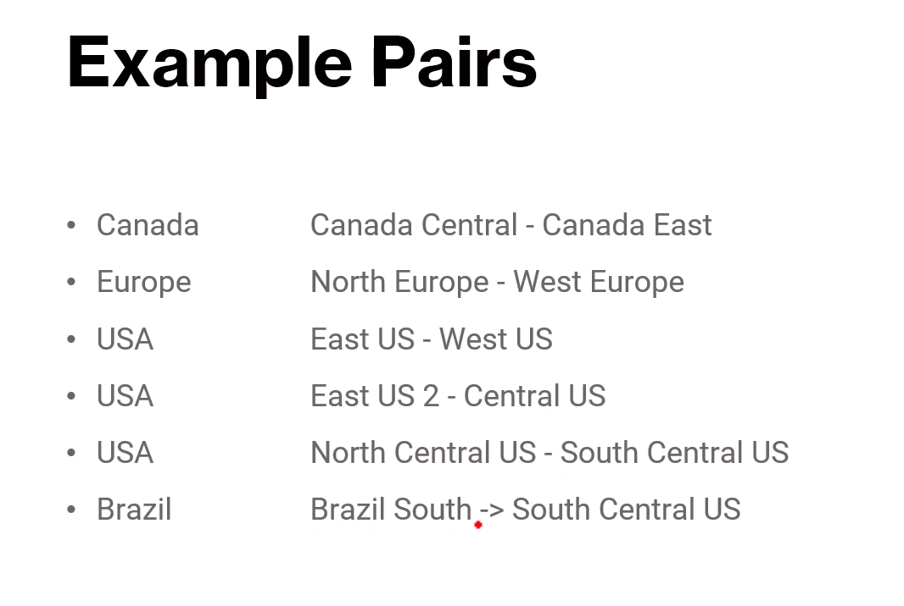
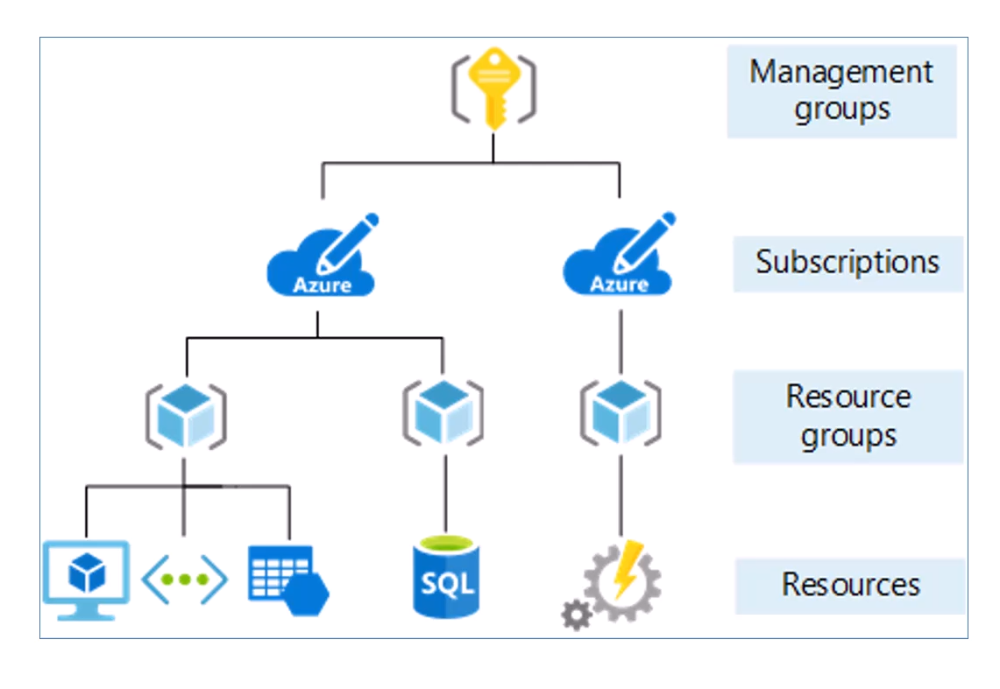
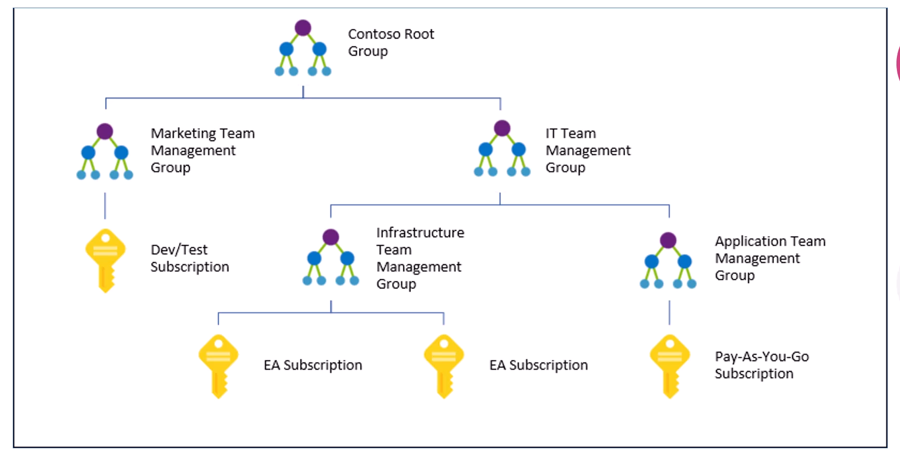
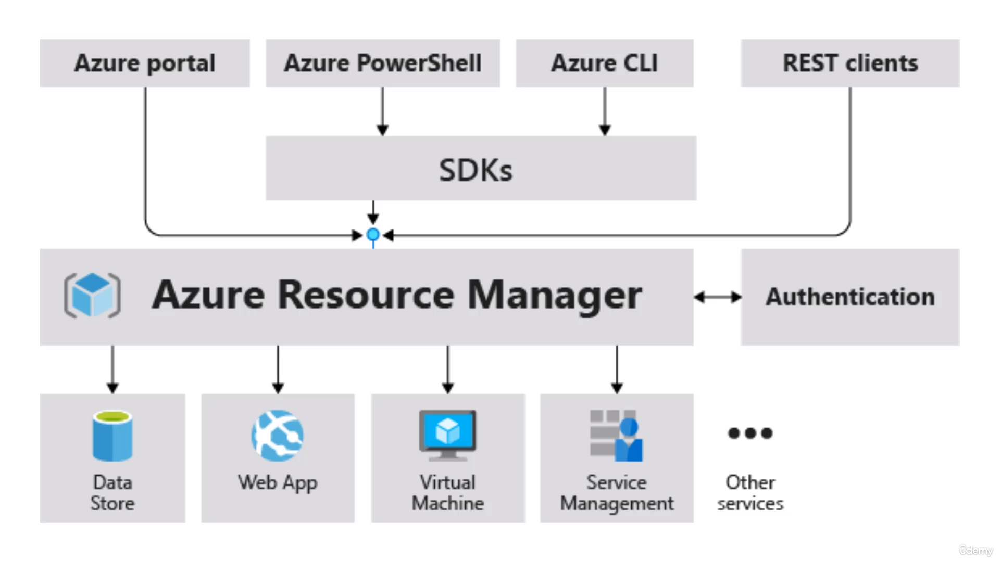

# Azure Fundamentals 
## VMs
* In Azure, you are charged for the VM per second
* In Windows, you have an Administrator username and password where as in Linux, you have SSH keys to access the instance
* You need to pay for the Windows  License by default, but can use yours if you already have one
* You can "resize" VMs to a bigger/smaller instance in Azure  
### Features
* Auto Shutdown option available

## Scaling
* There is a limit to vertical scaling in Azure 
* 96 vCPUs and 384 GB Memory is the upper limit for General Purpose Instances
* Vertical Scaling does ont improve availability (since you're upgrading a one single instance) 
* There is no limit to horizontal scaling

## IaaS 
* Azure Storage offers 5 PB of Storage Capacity 
* Network ingress Costs are free in Azure 

## PaaS
* Azure App Services is a PaaS 
* Includes autoscaling features, CI/CD, containers, staging and dev environments, etc ...

## Regions
* Usually, there is only one region per country, but in Azure, some countries have multiple regions

### Region Pair
* In Azure, you have something called a region pair, where two regions are paired. And these paired regions have highest speed connections and special treatment during Azure updates 



### Sovereign Regions
* Sovereign Regions are special clouds not available to the public but associated with the Government. You need special permissions/approval to connect to those cloud regions

## Availability Zones
* Not every region in Azure support AZs
* There are 3 types of services in Azure:
    * **Zonal**: You deploy services to a speicific AZ and duplicate it to other AZs for backup and availability
    * **Zone-Redundant**: Azure automatically deploys across multiple AZs in the region
    * **Always Available**: Services deployed globally across multiple regions such as the Azure Active Directory

## Resource, Resource Groups and Subscriptions

### Resource Groups
* Resources can be grouped with Resource Groups. RGs are associated with a region but it can contain resources from different regions.
* Each Resource **must** belong to **only one** resource group
* Permissions can be assigned at the resource group level
### Subscriptions
* Subscription is a billing unit in Azure
* There is a payment method associated with each subscription
* Subscription Plans include Free Plan, Pay-As-You-Go, Enterprise Agreement ....
* Subscriptions are usually used to seperate out diff depts in a business, Ex: Finance, IT, Sales.... OR seperate by Geography NA, Europe, Asia



### Management Groups
* Management Groups are used to group multiple subscriptions


## VM Scale Sets
* Multiple Virtual Machines running the same code
* Supports Autoscaling
* Can handle upto 100 VMs in a single scale set. Can configure it upto a 1000 VMs
* VM Scale set is free but you do pay for the underlying instances 

### Azure Virtual Desktop  
* Azure Virtual Desktop is a desktop version of Windows that runs in the cloud. You can log into it from anywhere 

## Networking Services
* ExpressRoute - A high speed private connection to Azure
* Peering Virtual Networks allows instances in one VN to communicate with instances in other VN. This can be global as well
* You have an option of creating a public/private endpoint on a resource that is created.   

## Storage Services
### Azure Storage
* In Azure, you create a Storage account and in that account you have 4 different types of storages:
    * Containers (Similar to object storage in S3)
    * File Shares
    * Queues
    * Tables
* You have `Standard` and `Premium` performance types in Azure Storage. Premium Performance = Low Latency
* A storage account supports max of 5 PBs 
* **Zone-redundant** storage stores multiple copies in different AZs where as **locally-redundant** storage stores only in the same AZ
* You also have Geo-redundant and Geo-Zone redundant that stores copy of your data in a secondary region. These both are available only in the Standard Performance type of Azure Storage
### Disk Storage
* In Azure storage you pay per GB whereas in Disk Storage, you pay for the full capacity (ex: 8GB Hard Disk)
```
Azure Storage => Unmanaged
Disk Storage => Managed
```

### Other Storage Services
* Azure **Storage Explorer** is a software that can be run on your local machine to upload files to storage. It is getting depreciated soon and is replaced with Storage browser instead which performs the similar functionality as well 
* **AZcopy** is a CLI tool that allows you to copy files across blob containers (Storage) in Azure. You can also use it to download files locally or even transfer to a storage bucket on another cloud
* Azure **File Sync** enables to sync on premises file server in the cloud
* Azure **Migrate** is a service that allows you to easily migrate to the cloud. It scans for VMs, databases, services in your environments (on-premises) and plans for your migration
* **DataBox** is a physical device that you can request for to transfer data to Azure offline 

## Identity Services
* Azure Active Directory (AAD) is an Identity as a Service provided by Azure. It is not the same as the traditional Active Directory that runs on Windows
* Developers can use AAD to implement authentication for their end users
* There is an option called Conditional access in AAD which allows to set up MFA and other restrictions on detecting unusual login 


### Zero Trust Security Model
* Just In Time (JIT) Model: You request for permissions only when you need it
* Just-Enough-Access (JEA): Least previlege principle 

### Role Based Control Access
* Roles in Azure are similar to GCP. They are permissions binded to users

> Policies are attached to resources whereas roles are attached to users

## Pricing Calculator
* Azure has a Total Cost Of Ownership (TCO) calculator that include the price of electiricty, cooling, maintenance and so on ...
* This can be used to compare your on-premises(TCO) cost with the cloud
## Security and Governance
Tools used for security and Governance:
### Azure Policy
* You can enforce a policy on resources created. 
* You can have all Vms have a backup on a regular basis
### Azure BluePrint
* You can create Blueprints and attach it to a subscription. The blueprint is created when the subscription is active. The blueprint maybe like have 5 EC2 instances with one Load balancer

### Resource Locks
* **Read only** locks and **cannot delete** locks on resources can be used

### Service Trust Portal
* Centralized repository for all the compliance artefacts by Azure

* Microsoft Defender is a paid service provided by Azure for security protection of cloud services 

## Azure Arc
* Azure Arc is a service that allows you to manage resources running on on-premised and multi-cloud. It is basically a unified view of all the resources that you are using

## Azure Resource Manager (ARM)
* Azure Resource Manager is what you interact with behind the hood when creating resources in the Console or CLI, powershell or anything ...


* You can create ARM templates and deploy those ARM templates to create Resources (more like Infrastrcture as a Code)